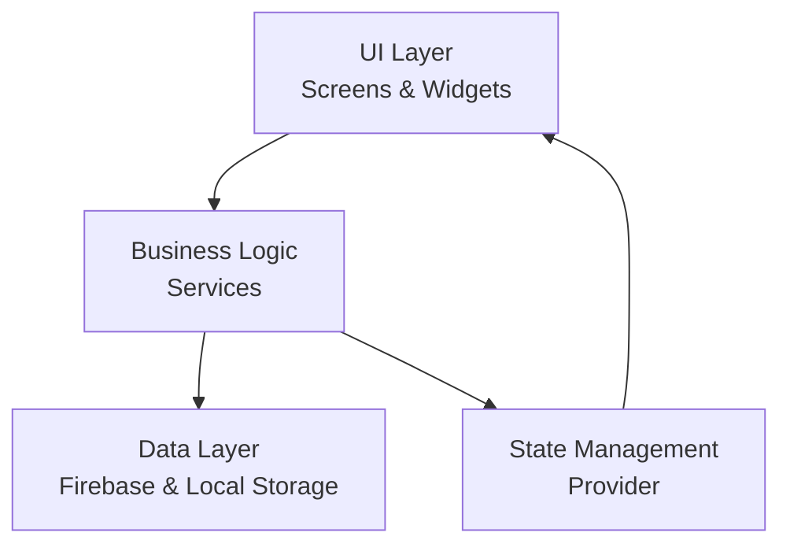
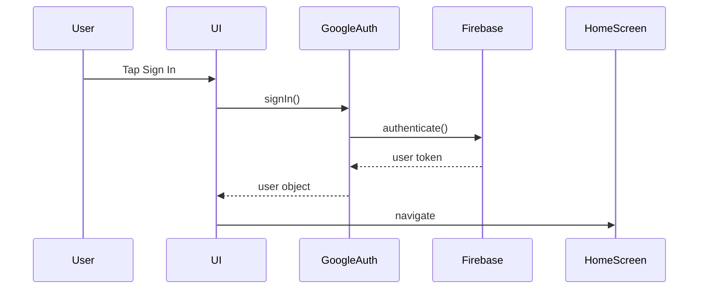
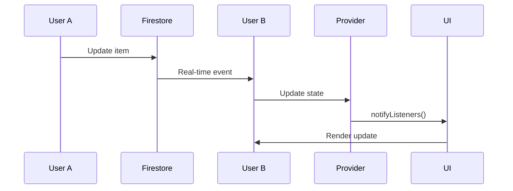
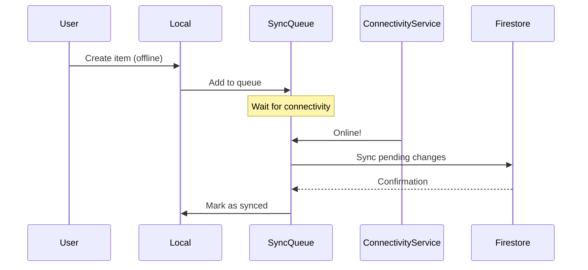
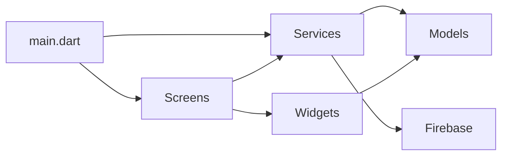

# Architecture

ShopSync follows clean architecture principles with a focus on offline-first functionality and real-time collaboration.

## High-Level Architecture



## Layers

### UI Layer

**Responsibility:** Presentation and user interaction

**Components:**

- **Screens** - Full-page views (`lib/screens/`)
- **Widgets** - Reusable UI components (`lib/widgets/`)
- **Themes** - Material Design 3 theming

**Key Principles:**

- Stateless where possible
- Consumer widgets for state
- Separate presentation from logic

### Business Logic Layer

**Responsibility:** Application logic and rules

**Components:**

- **Services** - Business logic (`lib/services/`)
- **Models** - Data structures (`lib/models/`)
- **Utils** - Helper functions (`lib/utils/`)

**Key Services:**

- `GoogleAuth` - Authentication
- `SharedPrefs` - Local preferences
- `ConnectivityService` - Network status
- `SmartSuggestionsService` - ML predictions

### Data Layer

**Responsibility:** Data persistence and retrieval

**Components:**

- **Cloud Firestore** - Cloud database
- **SharedPreferences** - Local key-value store
- **Provider** - In-memory state

**Data Flow:**

```
User Action → Service → Firestore → Real-time Listener → Provider → UI Update
```

## Design Patterns

### Offline-First Architecture

ShopSync prioritizes offline functionality:

1. **Write to Local First**

   ```dart
   // Update local state immediately
   localState.update(data);

   // Queue for cloud sync
   syncQueue.add(data);
   ```

2. **Sync When Online**

   ```dart
   // Listen for connectivity
   ConnectivityService.onOnline(() {
     syncQueue.process();
   });
   ```

3. **Conflict Resolution**
   ```dart
   // Last-write-wins with timestamps
   if (remoteTimestamp > localTimestamp) {
     acceptRemote();
   }
   ```

### State Management Pattern

Using Provider for reactive state:

```dart
class ListProvider extends ChangeNotifier {
  List<ShoppingList> _lists = [];

  void addList(ShoppingList list) {
    _lists.add(list);
    notifyListeners(); // Updates UI
  }
}
```

Consumption in widgets:

```dart
Consumer<ListProvider>(
  builder: (context, provider, child) {
    return ListView.builder(
      itemCount: provider.lists.length,
      itemBuilder: (context, index) {
        return ListTile(
          title: Text(provider.lists[index].name),
        );
      },
    );
  },
)
```

### Repository Pattern

Service layer abstracts data sources:

```dart
class ListRepository {
  final FirebaseFirestore _firestore;
  final LocalStorage _localStorage;

  Future<List<ShoppingList>> getLists() async {
    if (await ConnectivityService.isOnline()) {
      return _firestore.collection('lists').get();
    } else {
      return _localStorage.getLists();
    }
  }
}
```

## Component Architecture

### Authentication Flow



### Real-time Sync Flow



### Offline Sync Flow



## Firebase Architecture

### Data Structure

```
users/
  {userId}/
    profile/
      name: string
      email: string

shoppingLists/
  {listId}/
    name: string
    ownerId: string
    sharedWith: array
    createdAt: timestamp

    items/
      {itemId}/
        name: string
        quantity: string
        category: string
        checked: boolean
        createdBy: string
```

### Security Rules

Lists accessible only to owner and collaborators:

```javascript
match /shoppingLists/{listId} {
  allow read: if isOwnerOrShared(listId);
  allow write: if isOwner(listId);

  match /items/{itemId} {
    allow read, write: if isOwnerOrShared(listId);
  }
}
```

## Module Dependencies



## Platform-Specific Architecture

### Android

- Native Android lifecycle hooks
- Home widget integration
- WearOS companion app
- Google Play Services integration

### Web

- Progressive Web App (PWA) capabilities
- Responsive design breakpoints
- Web-specific Firebase initialization
- Browser storage fallbacks

### WearOS

!!! note "Read-Only Design"
WearOS app is intentionally designed as a companion viewer with completion capabilities only. This design decision optimizes battery life and user experience on the watch.

- Separate entry point (`wear_main.dart`)
- Optimized UI for small screens
- Rotary input support
- Limited feature set for watch

## Performance Considerations

### Lazy Loading

Lists and items loaded on-demand:

```dart
ListView.builder(
  itemCount: lists.length,
  itemBuilder: (context, index) {
    // Only build visible items
    return ListTile(...);
  },
)
```

### Image Caching

Icons cached locally:

```dart
CachedNetworkImage(
  imageUrl: iconUrl,
  cacheManager: CustomCacheManager(),
)
```

### Debouncing

Search and input debounced:

```dart
Timer? _debounce;
void onSearchChanged(String query) {
  _debounce?.cancel();
  _debounce = Timer(Duration(milliseconds: 300), () {
    performSearch(query);
  });
}
```

## Error Handling

### Layered Error Handling

```dart
try {
  await service.performAction();
} on FirebaseException catch (e) {
  handleFirebaseError(e);
} on NetworkException catch (e) {
  handleNetworkError(e);
} catch (e) {
  handleGenericError(e);
}
```

### Error Recovery

- Automatic retry with exponential backoff
- Fallback to cached data
- User-friendly error messages
- Sentry integration for crash reporting

## Testing Architecture

### Test Pyramid

```
        /\
       /  \        E2E Tests (Few)
      /----\
     /      \      Integration Tests (Some)
    /--------\
   /          \    Unit Tests (Many)
  /____________\
```

**Unit Tests:** Services, utilities, models
**Widget Tests:** UI components
**Integration Tests:** User flows

## Security Architecture

### Authentication

- Firebase Authentication
- Google Sign-In with Credential Manager
- Email/password with encryption
- Session management

### Data Protection

- HTTPS for all network requests
- Firestore security rules
- Local data encryption (future)
- No sensitive data in logs

## Scalability

### Current Scale

- Supports 1000+ lists per user
- 10,000+ items per list
- Real-time collaboration with 10+ users
- Handles offline sync for days

### Future Scaling

- Cloud Functions for server-side logic
- Indexed queries for large datasets
- Pagination for massive lists
- CDN for static assets

## Next Steps

- [Project Structure](project-structure.md)
- [State Management](state-management.md)
- [Firebase Integration](firebase.md)
- [Services Documentation](services.md)
