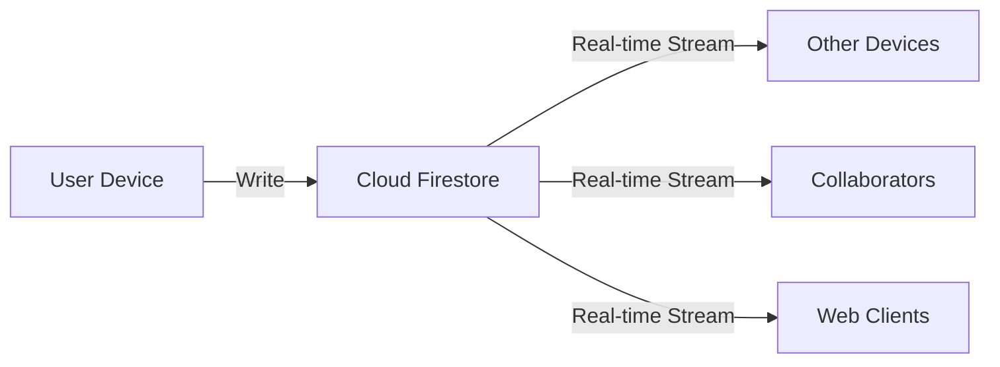

# Real-time Sync

ShopSync uses Firebase Cloud Firestore to provide instantaneous synchronization across all devices and users.

## How It Works

### Cloud Firestore

ShopSync leverages Firebase's real-time database:

- Changes broadcast to all connected clients
- Sub-100ms latency for updates
- Automatic conflict resolution
- Offline persistence built-in

### Sync Architecture



## What Syncs

### Automatically Synced

- ✅ List creation/deletion
- ✅ List name changes
- ✅ Item additions
- ✅ Item edits
- ✅ Check/uncheck status
- ✅ Categories
- ✅ List groups
- ✅ Sharing permissions

### User-Specific (No Sync)

- ❌ App settings
- ❌ Theme preferences
- ❌ Local cache

## Sync Behavior

### Immediate Sync

Most changes sync within 100ms:

- Item checked/unchecked
- Item added/deleted
- List renamed

### Batched Sync

Some operations batch for efficiency:

- Multiple rapid edits
- Bulk operations
- Category assignments

### Background Sync

Syncs even when app is closed (if enabled in settings).

## Collaboration Features

### Active User Indicators

See who's currently viewing the list:

- Avatar badges
- "Currently viewing" label
- Last active timestamp

### Typing Indicators

See when someone is editing:

- "User is typing..." indicator
- Real-time cursor position (coming soon)

### Edit History

Track all changes:

- Who made the change
- What was changed
- When it happened

## Sync Status

### Visual Indicators

| Icon | Meaning  |
| ---- | -------- |
| ☁️   | Synced   |
| 🔄   | Syncing  |
| 📴   | Offline  |
| ⚠️   | Conflict |
| ❌   | Error    |

### Monitoring Sync

View sync status:

1. Open a list
2. Pull down to refresh
3. Status shown briefly at top

## Conflict Resolution

### Automatic Resolution

ShopSync handles most conflicts automatically:

**Last-Write-Wins:**

- Most recent change takes precedence
- Timestamps determine order

**Field-Level Merging:**

- Different fields don't conflict
- Item name vs. quantity edited separately

**Additive Operations:**

- New items always added
- Deletions take priority over edits

### Manual Resolution

Rarely, you may need to resolve manually:

1. Conflict status appears in the list
2. View both versions
3. Choose which to keep
4. Or merge changes manually

## Performance Optimization

### Efficient Data Transfer

- Only changed fields transmitted
- Compressed data payloads
- Incremental updates

### Connection Management

- Automatic reconnection
- Exponential backoff on errors
- Bandwidth-aware sync

### Battery Optimization

- WiFi-preferred sync
- Reduced frequency on low battery
- Smart background sync

## Sync Settings

Configure sync behavior in **Settings** → **Offline & Sync**:

- **Auto-sync** - Sync automatically when online
- **Sync frequency** - How often to check for updates
- **WiFi only** - Don't use cellular data
- **Background sync** - Sync when app is closed

## Troubleshooting

### Slow Sync

If synchronization seems slow:

1. Check internet connection speed
2. Ensure Firestore isn't down
3. Clear app cache
4. Update to latest version

### Changes Not Appearing

1. Force refresh (pull down)
2. Check connection status
3. Verify other device is online
4. Sign out and back in

### Duplicate Items

Usually resolves automatically, but if not:

1. Delete the duplicate
2. Report if it persists

## Technical Details

### Firebase Integration

ShopSync uses:

- **Cloud Firestore** - Real-time NoSQL database
- **Firebase Auth** - User identity and permissions
- **Security Rules** - Server-side data protection

### Data Structure

Lists and items stored hierarchically:

```
users/{userId}/
  shoppingLists/{listId}/
    items/{itemId}
```

### Sync Protocol

1. Client writes to local cache
2. Change queued for sync
3. Upload to Firestore
4. Firestore broadcasts to listeners
5. Other clients receive update
6. UI updates automatically

## Best Practices

!!! tip "Sync Tips" - **Keep app updated** - Latest version has sync improvements - **Use WiFi when possible** - Faster, more reliable - **Don't force-quit app** - Prevents background sync - **Check sync status** - Ensure changes uploaded before closing

## Next Steps

- [Offline Mode](../user-guide/offline-mode.md)
- [Sharing & Collaboration](../user-guide/sharing.md)
- [Firebase Integration](../developer-guide/firebase.md)
